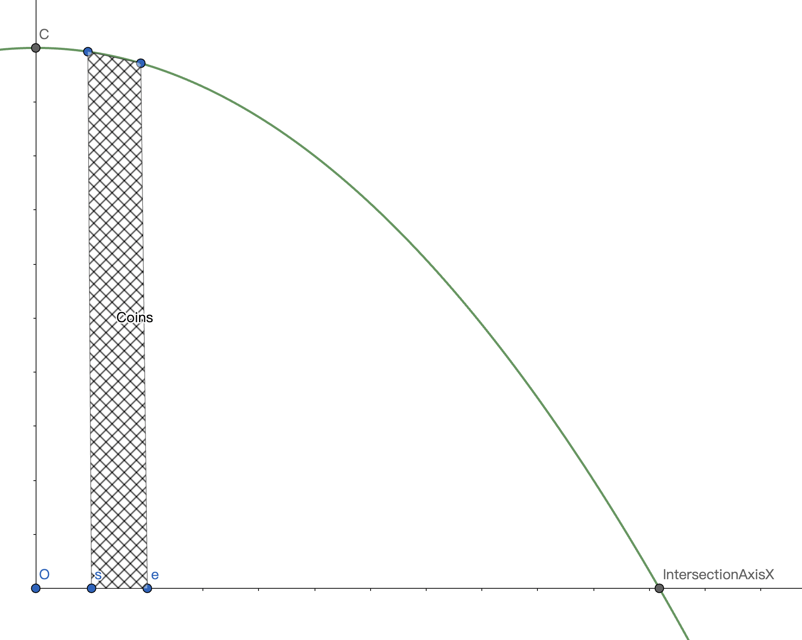

# Parabola

Generate token using parabola, full decetralized minting rule

---
## Token genration's rule

$$
f(x) = ax^2+bx+c
$$
make b = 0, then
$$
f(x) = ax^2+c
$$
then
$$
\int_{s}^{e}\: f(x) dx=\frac{a\left(e^3-s^3\right)}{3}+c(e-c)
$$

when `s` = 0, `e` is the abscissa of the intersection of the curve and the X-axis, we will get the coin's total supply

when `s` is user's starting abscissa, `e` is the user's end abscissa, we will get the number of coins minted by the user, where `e` = `s` + `step`

example figure

----
onece total supply(T) coins and total user(E) is confirmed,
we can see

$$
a=-\frac{3T}{2E^3},c=\frac{3T}{2E}
$$

---

## Local development

1. install packages
   
   `yarn` or `npm i`

2. create `.env` file and set your mnemonic as below

   `MNEMONIC="your mnemonic"`

3. compile contracts, it will generate contract artifacts also typechains

   `yarn build`

4. test contracts

   `yarn test`

5. deploy contracts, `network name` is configured in your [hardhat.config.ts](https://github.com/Alexandas/Parabola/blob/master/hardhat.config.ts#L48), once contracts are deployed, hardhat will generate deployments files

   `npx hardhat --network {{network name}} deploy`

6. verify contracts

   `npx hardhat --network {{network name}} verify {contract address}`

---
